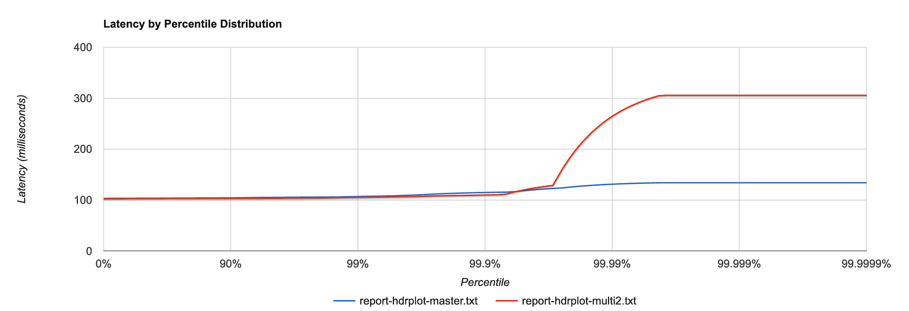
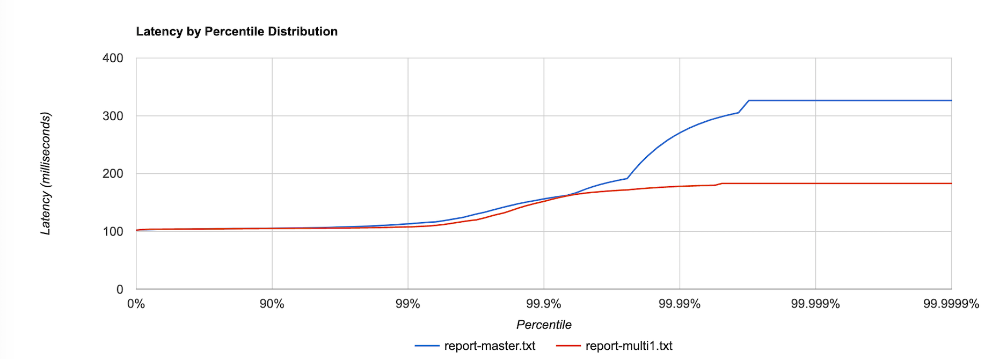

# Load Test Results

## Context

There has been significant changes to the internals of origin_simulator to enable [multi-route origin simulation](https://github.com/bbc/origin_simulator/tree/multi-route-origin-simulation). The simulation state data structure is now a Map containing routes and the corresponding simulation state, instead of a tuple of global latency and status values. There is also an inherest cost in looking up state data per route.

## Hypothesis

- The performance of [multi-route origin simulation](https://github.com/bbc/origin_simulator/tree/multi-route-origin-simulation) is comparable with single-origin simulation, i.e. the [current master branch](https://github.com/bbc/origin_simulator/tree/04a9fd3bc5a6c3259c816024e72a398096768f70).

## Setup
- Vegeta Runner on EC2
- OriginSimulator deployed on EC2: Type: 1 x c5.2xlarge instance, CPUs: 8 vCPUs (4 core, 2 threads per core)

## Tests
Run the following tests on test origins (see below)

1. 60s, 200rps, 0ms simulated latency
2. 60s, 200rps, 100ms simulated latency
3. 180s 500rps, 100ms simulated latency on master, multi1
4. Concurrent 60s, 200rps, 100ms simulated latency test on 3 routes / 3 origins

## Test Origins
Single-origin: OriginSimulator running the current master branch

- `master`, origin: http://www.bbc.co.uk/news, route: "/"

Multiple-route: OriginSimulator running the [multi-route-origin-simulation](https://github.com/bbc/origin_simulator/tree/multi-route-origin-simulation) branch

- `multi1`, origin: http://www.bbc.co.uk/news, route: "/news" 
- `multi2`, origin: http://www.bbc.co.uk/sport, route: "/sport"
- `multi3`: origin: http://www.bbc.co.uk/sounds, route: "/sounds"

## Results

The performance of multi-route origin simulation is similar to that of the current master branch (non-route simulation).

### 1. 60s, 200rps, 0ms latency

#### `master`

```
ID: 1581088819782
Requests      [total, rate, throughput]  12000, 200.02, 200.01
Duration      [total, attack, wait]      59.998s, 59.995s, 2.709ms
Latencies     [mean, 50, 95, 99, max]    2.798ms, 2.721ms, 3.279ms, 3.587ms, 34.64ms
Bytes In      [total, mean]              5561136000, 463428.00
```

[Results](https://broxy.tools.bbc.co.uk/belfrage-loadtest-results/vegeta-60s-200rps-1581088819782)

#### `multi1`

```
ID: 1581081597677
Requests      [total, rate, throughput]  12000, 200.02, 200.01
Duration      [total, attack, wait]      59.997s, 59.995s, 2.062ms
Latencies     [mean, 50, 95, 99, max]    2.086ms, 2.047ms, 2.348ms, 2.632ms, 26.88ms
Bytes In      [total, mean]              5557464000, 463122.00
```

[Results](https://broxy.tools.bbc.co.uk/belfrage-loadtest-results/vegeta-60s-200rps-1581081597677)

`multi2`, `multi3` tests yield similar results:

- [multi2](https://broxy.tools.bbc.co.uk/belfrage-loadtest-results/vegeta-60s-200rps-1581081709492)
- [multi3](https://broxy.tools.bbc.co.uk/belfrage-loadtest-results/vegeta-60s-200rps-1581081884398)

### 2. 60s, 200rps, 100ms latency

#### `master`

```
ID: 1581089005365
Requests      [total, rate, throughput]  12000, 200.02, 199.67
Duration      [total, attack, wait]      1m0.098s, 59.995s, 103.493ms
Latencies     [mean, 50, 95, 99, max]    103.916ms, 103.660ms, 105.238ms, 107.031ms, 134.064ms
Bytes In      [total, mean]              5560356000, 463363.00
```

[Results](https://broxy.tools.bbc.co.uk/belfrage-loadtest-results/vegeta-60s-200rps-1581089005365)

#### `multi1`

```
ID: 1581080186366
Requests      [total, rate, throughput]  12000, 200.02, 199.67
Duration      [total, attack, wait]      1m0.0988s, 59.995s, 103.013ms
Latencies     [mean, 50, 95, 99, max]    103.043ms, 102.969ms, 103.521ms, 105.138ms, 306.457ms
Bytes In      [total, mean]              5543760000, 461980.00
```

[Results](https://broxy.tools.bbc.co.uk/belfrage-loadtest-results/vegeta-60s-200rps-1581080186366)

`multi2`, `multi3` tests yield similar results:

- [multi2](https://broxy.tools.bbc.co.uk/belfrage-loadtest-results/vegeta-60s-200rps-1581080415847)
- [multi3](https://broxy.tools.bbc.co.uk/belfrage-loadtest-results/vegeta-60s-200rps-1581080592000)

### 3. 180s 500rps, 100ms latency

#### `master`

```
ID: 1581326372837
Requests      [total, rate, throughput]  30808, 500.02, 499.19
Duration      [total, attack, wait]      1m1.716s, 1m1.614s, 102.388ms
Latencies     [mean, 50, 95, 99, max]    104.292ms, 103.818ms, 106.314ms, 112.997ms, 326.687ms
Bytes In      [total, mean]              14305355912, 464339.00
```

[Results](https://broxy.tools.bbc.co.uk/belfrage-loadtest-results/vegeta-180s-500rps-1581326372837)

#### `multi1`

```
ID: 1581324622973
Requests      [total, rate, throughput]  29330, 500.02, 499.13
Duration      [total, attack, wait]      58.7622s, 58.658s, 104.293ms
Latencies     [mean, 50, 95, 99, max]    104.206ms, 104.033ms, 105.416ms, 107.754ms, 182.962ms
Bytes In      [total, mean]              13618094980, 464306.00
```

[Results](https://broxy.tools.bbc.co.uk/belfrage-loadtest-results/vegeta-180s-500rps-1581324622973)

### 4.  Concurrent 60s, 200rps, 100ms simulated latency
#### `multi1`

```
ID: 1581081010811
Requests      [total, rate, throughput]  12000, 200.02, 199.67
Duration      [total, attack, wait]      1m0.098s, 59.995s, 103.265ms
Latencies     [mean, 50, 95, 99, max]    103.032ms, 102.922ms, 103.823ms, 105.381ms, 307.446ms
Bytes In      [total, mean]              5543760000, 461980.00
```

[Results](https://broxy.tools.bbc.co.uk/belfrage-loadtest-results/vegeta-60s-200rps-1581081010811)

#### `multi2`

```
ID: 1581081019037
Requests      [total, rate, throughput]  12000, 200.02, 199.67
Duration      [total, attack, wait]      1m0.098s, 59.995s, 102.662ms
Latencies     [mean, 50, 95, 99, max]    103.207ms, 103.122ms, 104.052ms, 105.064ms, 112.502ms
Bytes In      [total, mean]              5664840000, 472070.00
```

[Results](https://broxy.tools.bbc.co.uk/belfrage-loadtest-results/vegeta-60s-200rps-1581081019037)

#### `multi3`

```
ID: 1581081031608
Requests      [total, rate, throughput]  12000, 200.02, 199.67
Duration      [total, attack, wait]      1m0.0977s, 59.995s, 102.676ms
Latencies     [mean, 50, 95, 99, max]    103.336ms, 103.240ms, 104.245ms, 105.593ms, 111.997ms
Bytes In      [total, mean]              4683084000, 390257.00
```

[Results](https://broxy.tools.bbc.co.uk/belfrage-loadtest-results/vegeta-60s-200rps-1581081031608)

## Comparison



60s 200rps, 100ms latency, `master` vs. `multi2`


180s 500rps, 100ms latency, `master` vs. `multi1`

## Notes:

Most results exhibit a similar trend in which the slower requests happened at the beginning of test.
This might be a characteristic of BEAM/ETS when a single route/page is requested repeatedly.

OriginSimulator does not utilises much CPU, with occasional ~50% (single core) spikes observed.

